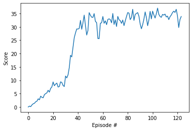

# Report

## Learning Algorithm

### DDPG
DDPG algorithms are classified as actor-critic and can also be viewed as approximate DQNs. Two neural networks Actor and Critic are used.
Actors learn about best actions, and Critics learn how to evaluate optimal action value functions using actors' best believed actions.    

Hyperparameters in `code/Continuous_Control.ipynb`
- DDPG Agent
	- `BUFFER_SIZE` = 100000
		- replay buffer size
	- `BATCH_SIZE` = 256
		- minibatch size
	- `GAMMA` = 0.9
		- discount factor
	- `TAU` = 1e-3
		- for soft update of target parameters
	- `LR_ACTOR` = 1e-3
		- learning rate of the actor
	- `LR_CRITIC` = 1e-3
		- learning rate of the critic
	- `WEIGHT_DECAY` = 0
		- L2 weight decay
	- `learn_period` = 20
		- how often to update the network
	- `n_learn` = 10
		- how many times to train the network
- OUNoise
	- `mu` = 0
		- the mean
	- `theta` = 0.15
		- how quickly to return to the mean
	- `sigma` = 0.1
		- the variability of the process


### NN Model Architecture: Actor, Critic
Actor NN model consists of 3 `torch.nn.Linear` layers, and the activation functions of the 1st and 2nd layer is `torch.nn.functional.relu`, of 3rd layer is `torch.nn.functional.tanh`.
Batch normalization was performed on the output of the first linear layer.
- input shape: `(37,)`
- output shape: `(4,)`
- (The first argument value of the shape shown below indicates the batch size.)

```
----------------------------------------------------------------
        Layer (type)               Output Shape         Param #
================================================================
            Linear-1                  [-1, 128]           4,352
       BatchNorm1d-2                  [-1, 128]             256
            Linear-3                  [-1, 128]          16,512
            Linear-4                    [-1, 4]             516
================================================================
```

Critic NN model consists of 3 `torch.nn.Linear` layers, and the activation functions of the 1st and 2nd layer is `torch.nn.functional.relu`.
Batch normalization was performed on the output of the first linear layer.
- input shape: `[(37,), (4,)]`
- output shape: `(1,)`
- (The first argument value of the shape shown below indicates the batch size.)

```
----------------------------------------------------------------
        Layer (type)               Output Shape         Param #
================================================================
            Linear-1                  [-1, 128]           4,352
       BatchNorm1d-2                  [-1, 128]             256
            Linear-3                  [-1, 128]          17,024
            Linear-4                    [-1, 1]             129
================================================================
```

## Plot of Rewards
Environment solved in 124 episodes!
- Average Score: 30.04



## Ideas for Future Work
In this project, I tried various combinations of hyperparameters, but the adjustment of OUNoise-related hyperparameters seems to be the most critical than other factors. If I adjust it a little more finely, it seems that I can make it converge faster. It is also possible to consider using other activation functions such as leaky-relu instead of relu as the activation functions of the actor and critic networks.